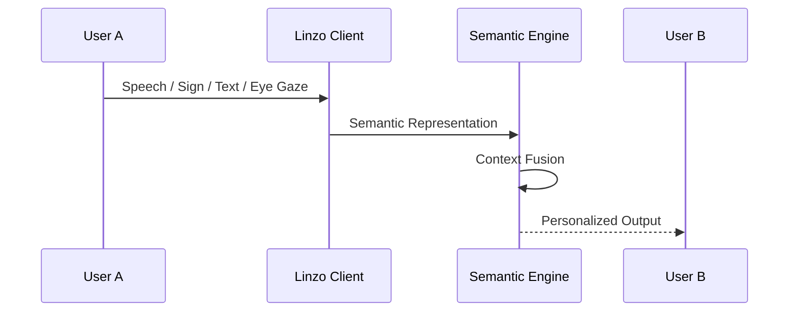
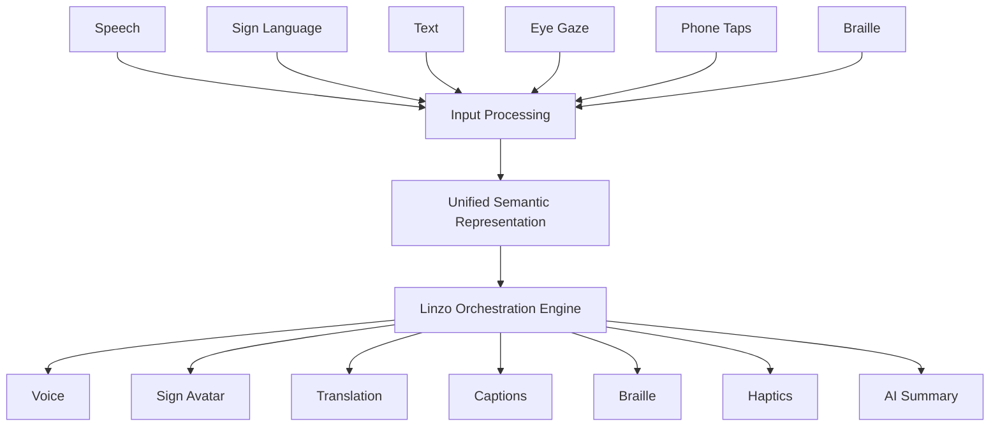
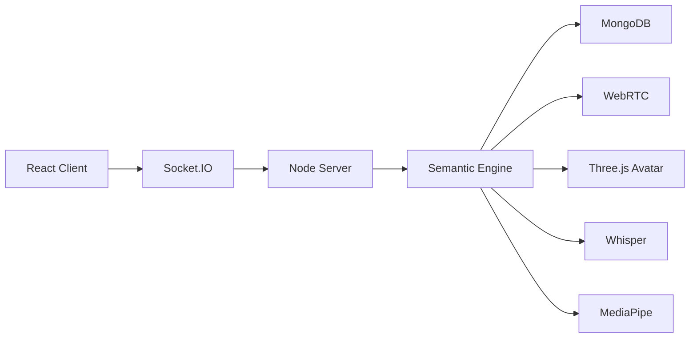

<div align="center">

# 🚀 Linzo Meet

### **One Conversation. Every Modality. Every Participant.**

### AI-Powered Multimodal Communication Infrastructure

*Breaking Accessibility & Language Barriers through Unified Semantic Orchestration*

<br>


</div>

---

<p align="center">


</p>

---

# 🌍 Overview

Communication is one of humanity's most fundamental abilities.

Yet nearly every communication platform built today assumes that every participant can hear, speak, read, understand the same language, and communicate in exactly the same way.

That assumption silently excludes hundreds of millions of people every single day.

Linzo reimagines communication from first principles.

Instead of translating one communication modality into another, Linzo first understands **what** a participant intends to communicate, then intelligently renders that meaning into the most appropriate output for every participant simultaneously.

Rather than building separate pipelines such as

```
Speech → Text

Speech → Sign

Speech → Braille

Speech → Translation

Speech → Haptics
```

Linzo introduces a **Unified Semantic Orchestration Engine**, transforming every communication modality into a shared semantic representation before dynamically generating personalized outputs.

This architecture eliminates the traditional **N × N translation problem**, allowing new communication modalities to be integrated without redesigning the entire communication stack.

---

# 🎯 Why Linzo?

Existing accessibility solutions solve **individual communication problems.**

Voice assistants understand speech.

Translation systems understand languages.

Captioning systems generate text.

Sign language systems animate gestures.

AAC devices help speech-impaired users.

Braille devices assist visually impaired users.

Every solution exists in isolation.

Linzo unifies them into a **single communication infrastructure** capable of orchestrating conversations across different communication abilities, languages, devices, and accessibility requirements in real time.

Instead of asking users to adapt to technology,

**Linzo adapts technology to every participant.**

---

# ✨ Core Capabilities

## 🧠 Unified Semantic Communication

Convert every communication modality into a shared semantic representation before rendering personalized outputs.

Supported inputs include:

- Speech
- Sign Language
- Text
- Eye Gaze
- Phone Taps
- Braille Devices
- Accessibility Devices

Supported outputs include:

- Natural Voice
- 3D Sign Language Avatar
- Live Captions
- Real-time Translation
- Smart Haptic Feedback
- Braille Rendering
- AI Meeting Intelligence

---

## 🌐 Inclusive Communication

Enable participants with completely different communication abilities to communicate naturally inside the same live meeting.

Examples include

```
Speech ↔ Sign Language

Speech ↔ Braille

Speech ↔ Eye Gaze

Speech ↔ Phone Taps

Speech ↔ Translation

Speech ↔ Captions

Sign ↔ Voice

Text ↔ Voice

Eye Gaze ↔ Speech

Braille ↔ Voice
```

without requiring individual translation pipelines.

---

# 🏛 Philosophy

Linzo is not designed to become another communication application.

It is designed to become the **communication infrastructure** that existing communication platforms can build upon.

Instead of replacing platforms like Zoom, Microsoft Teams, Google Meet, telephony providers, healthcare platforms, or enterprise collaboration suites,

Linzo augments them through APIs, SDKs, and semantic communication orchestration.

---

# 🚀 Key Features

| Capability | Description |
|------------|-------------|
| 🎥 Real-Time Communication | HD Video & Voice Conferencing powered by WebRTC |
| 🤟 Sign Language Intelligence | Speech ↔ Sign Language using MediaPipe & 3D Avatars |
| 🌍 Neural Translation | Real-time multilingual conversations across 120+ languages |
| 👁 Eye Gaze Communication | Eye-tracked text selection converted into natural speech |
| 📱 Phone Tap Communication | Adaptive tap-based communication converted into voice |
| 📳 Smart Haptic Communication | Context-aware vibration rendering for accessibility |
| ♿ Accessibility Device Support | Braille displays and assistive technologies |
| 📝 AI Meeting Intelligence | Live summaries, action items, follow-ups, semantic search |
| 🔗 Productivity Integrations | Notion, Jira, Google Calendar, Asana & Enterprise APIs |
| ⚡ Unified Semantic Engine | Proprietary orchestration replacing parallel translation pipelines |
| 🧩 Modular AI Architecture | Plug-and-play support for future communication modalities |
| 🔒 Privacy First | Local landmark extraction with compressed semantic streaming |

---

# 🏆 What Makes Linzo Different?

Traditional systems translate **formats.**

Linzo understands **meaning.**

That single architectural decision enables unlimited combinations of communication modalities while keeping the system scalable, extensible, and future-proof.

```
Speech
Sign
Text
Braille
Phone Taps
Eye Gaze
        │
        ▼
Unified Semantic Representation
        │
        ▼
Linzo Orchestration Engine
        │
 ┌──────┼────────┬─────────┐
 ▼      ▼        ▼         ▼
Voice  Avatar  Braille  Translation
```

Communication should never decide who gets an opportunity.

Linzo exists to ensure it never does.

---

# 🏗 System Architecture

Unlike conventional accessibility platforms that rely on independent translation pipelines for every communication modality, Linzo introduces a **Unified Semantic Communication Architecture**, where all modalities converge into a shared semantic representation before being rendered into personalized outputs.

This architecture dramatically reduces system complexity, enables seamless multimodal interoperability, and allows future communication modalities to be integrated without redesigning the communication engine.

---

# 🧠 Linzo Unified Semantic Orchestration Engine

The **Unified Semantic Orchestration Engine (USOE)** is the computational core of Linzo.

Instead of directly translating between modalities (Speech → Sign, Speech → Braille, Sign → Voice, etc.), every input first passes through a semantic abstraction layer where its **meaning, context, participant state, and conversation history** are unified into a single modality-independent representation.

The orchestration engine then dynamically renders this semantic state into the optimal output format required by each participant.

```
                         INPUT LAYER

      Speech     Sign     Text     Eye Gaze
         │          │        │          │
         ├──────────┼────────┼──────────┤
                    │
            Phone Taps • Braille
                    │
                    ▼
        ┌───────────────────────────┐
        │  Input Processing Layer   │
        │                           │
        │ Whisper ASR               │
        │ MediaPipe Landmarks       │
        │ OCR & Text Parsers        │
        │ Gesture Recognition       │
        │ Eye Gaze Tracking         │
        │ Accessibility Adapters    │
        └───────────────────────────┘
                    │
                    ▼
        ┌───────────────────────────┐
        │ Unified Semantic State    │
        └───────────────────────────┘
                    │
                    ▼
        ┌───────────────────────────┐
        │ Linzo Orchestration Engine│
        │                           │
        │ Context Management        │
        │ Participant Awareness     │
        │ Semantic Fusion           │
        │ AI Routing                │
        │ Conversation Memory       │
        └───────────────────────────┘
                    │
                    ▼
        ┌───────────────────────────┐
        │ Adaptive Output Layer     │
        └───────────────────────────┘
                    │
    ┌───────────────┼────────────────────┐
    ▼               ▼                    ▼
 Voice        Sign Avatar          Translation
 Braille      Captions             Smart Haptics
 Action Items AI Summary           Calendar Sync
```

---

# ⚡ Communication Pipeline

```
Participant Input

↓

Multimodal Input Capture

↓

AI Encoding Layer

↓

Unified Semantic Representation

↓

Context-Aware Semantic Fusion

↓

Participant State Synchronization

↓

Adaptive Modality Routing

↓

Personalized Output Rendering

↓

Real-Time Delivery
```

---

# 🧩 Core Components

## ① Multimodal Input Layer

Responsible for acquiring communication from heterogeneous input modalities.

Supported inputs include

- Voice
- Sign Language
- Text
- Eye Gaze
- Phone Taps
- Braille Devices
- Assistive Technologies

Each modality is processed independently before semantic fusion.

---

## ② AI Encoding Layer

Each modality is transformed into structured machine-understandable representations.

| Input | Processing Pipeline |
|---------|--------------------|
| Speech | Whisper ASR |
| Sign Language | MediaPipe Landmark Extraction + TensorFlow.js |
| Text | Semantic Parsing |
| Eye Gaze | Eye Tracking + Selection Engine |
| Phone Taps | Adaptive Gesture Decoder |
| Braille | Braille Parser |

These modality-specific encoders operate independently while producing standardized semantic representations.

---

## ③ Unified Semantic Representation

The core innovation of Linzo.

Instead of translating

```
Speech

↓

Text

↓

Sign

↓

Braille
```

every modality is converted into a common semantic state.

```
Meaning

Intent

Context

Conversation State

Participant Identity

Temporal Information
```

This representation becomes the single source of truth for every communication session.

Advantages include

✅ Eliminates N × N translation pipelines

✅ Modality-independent reasoning

✅ Future communication extensibility

✅ Context-aware AI

✅ Shared conversational understanding

---

## ④ Linzo Orchestration Engine

The orchestration engine continuously manages

### Semantic Fusion

Combines information arriving simultaneously from multiple communication modalities.

---

### Context Management

Maintains conversational context across participants.

Supports

- Multi-turn conversations

- Interruptions

- Participant switching

- Context recovery

---

### Participant Synchronization

Every participant receives communication according to their own accessibility profile.

Example

```
Participant A

Speech

↓

Participant B

Sign Avatar

↓

Participant C

Braille

↓

Participant D

Japanese Translation

↓

Participant E

Live Captions
```

All generated from a single semantic state.

---

### Adaptive Modality Routing

The orchestration engine automatically selects the most appropriate communication output based on

- Accessibility preferences

- Device capabilities

- Network quality

- User profile

- Session context

No manual switching required.

---

# 🎯 Adaptive Output Layer

Semantic representations are rendered into personalized communication outputs.

Supported outputs

- Natural Neural Speech
- Three.js 3D Sign Avatar
- Live Captions
- Real-Time Translation
- Braille Rendering
- Smart Haptic Feedback
- AI Summaries
- Action Items
- Productivity Integrations

Multiple outputs can be generated simultaneously without duplicating inference.

---

# ⚙ Engineering Highlights

### Semantic-first Architecture

Communication is represented as **meaning**, not modality.

---

### Stateless Input Adapters

Each communication modality functions as an independent plug-in encoder.

---

### Stateful Orchestration

Conversation context, participant preferences, and semantic history remain synchronized throughout the session.

---

### Modular Output Rendering

New communication modalities can be added without modifying existing communication pipelines.

---

### Plug-and-Play Accessibility

Future communication interfaces (AR Glasses, EEG, BCI, Wearables, Smart Rings) can be integrated by implementing only

```
Input Adapter

or

Output Renderer
```

without changing the orchestration engine.

---

# 🚀 Why This Architecture Matters

Traditional accessibility systems scale like

```
Speech ↔ Sign

Speech ↔ Braille

Speech ↔ Translation

Speech ↔ Captions

Speech ↔ Eye Gaze

...
```

As new modalities are introduced, the number of translation pipelines grows rapidly.

Linzo replaces this with

```
Every Input

↓

Unified Semantic State

↓

Every Output
```

reducing architectural complexity while enabling unlimited communication combinations across languages, accessibility technologies, and future interaction modalities.

This semantic-first architecture transforms Linzo from an accessibility application into a scalable **AI-powered communication infrastructure** capable of supporting the next generation of inclusive communication systems.

---

# ⚙️ AI & Technical Deep Dive

## AI Pipeline

Linzo follows a **semantic-first multimodal AI pipeline**, where heterogeneous communication inputs are transformed into a unified semantic representation before adaptive rendering.

```
Speech
Sign Language
Eye Gaze
Phone Taps
Braille
Text
      │
      ▼
Input Processing
      │
      ▼
Semantic Encoding
      │
      ▼
Unified Semantic Representation
      │
      ▼
Context-Aware Orchestration
      │
      ▼
Adaptive Output Rendering
```

Unlike traditional AI systems that perform direct modality-to-modality translation, Linzo separates **understanding** from **rendering**, enabling every communication modality to operate independently while remaining semantically synchronized.

---

# 🧩 AI Components

| Component | Purpose |
|------------|----------|
| Whisper ASR | Speech Recognition |
| MediaPipe | Hand & Pose Landmark Extraction |
| TensorFlow.js | Landmark Classification & Local Inference |
| ONNX Runtime | Lightweight Edge AI Inference |
| Three.js | Real-time 3D Avatar Rendering |
| WebRTC | Low-latency Media Streaming |
| Socket.IO | Event Synchronization |
| Node.js | Semantic Orchestration |
| MongoDB | Persistent Context & Meeting Storage |

---

# 🎤 Speech Processing Pipeline

```
Microphone

↓

Noise Reduction

↓

Voice Activity Detection

↓

Whisper ASR

↓

Text Normalization

↓

Semantic Encoding

↓

Unified Semantic State
```

Speech is converted into semantic representations instead of directly generating captions or translations.

This enables the same spoken sentence to simultaneously produce

- Sign Language
- Voice Translation
- AI Summary
- Action Items
- Captions
- Braille Output

without repeated inference.

---

# 🤟 Sign Language Pipeline

```
Camera

↓

MediaPipe

↓

3D Hand & Pose Landmarks

↓

Landmark Normalization

↓

TensorFlow.js Classification

↓

Semantic Encoding

↓

Unified Semantic Representation
```

Rather than transmitting raw video frames, Linzo processes **geometric landmark representations**, significantly reducing bandwidth while preserving communication semantics.

Advantages

✅ Privacy preserving

✅ Lower bandwidth

✅ Faster inference

✅ Device-independent

---

# 🌍 Translation Pipeline

```
Participant A

↓

Semantic Encoding

↓

Unified Semantic State

↓

Neural Translation

↓

Participant B Preferred Language
```

Unlike conventional translators, translation occurs **after semantic understanding**, improving contextual consistency across multilingual conversations.

---

# 🧠 AI Meeting Intelligence

Every meeting generates a continuously evolving semantic memory.

```
Conversation

↓

Semantic Timeline

↓

AI Summarization

↓

Action Extraction

↓

Follow-up Generation

↓

Meeting Memory
```

Capabilities

- Meeting Summaries
- Action Items
- Key Decisions
- Follow-up Suggestions
- Conversation Search
- Context Retrieval

---

# 🔄 Semantic Memory Engine

Every communication session maintains

```
Conversation Context

+

Participant State

+

Temporal Memory

+

Accessibility Preferences

+

Language Preferences
```

This allows Linzo to generate

- Context-aware translations
- Personalized summaries
- Intelligent follow-ups
- Participant-specific outputs

instead of isolated message translations.

---

# ⚡ Low-Latency Communication

Communication latency is minimized through a hybrid **Edge–Cloud architecture**.

```
Device

↓

Edge Inference

↓

Compressed Semantic Data

↓

Cloud Orchestration

↓

Adaptive Rendering
```

---

# 🖥 Edge AI

Executed locally

- MediaPipe Landmark Extraction
- TensorFlow.js Classification
- Camera Processing
- Eye Tracking
- Gesture Detection

Benefits

- Lower latency
- Better privacy
- Reduced bandwidth
- Faster response

---

# ☁ Cloud AI

Executed on server

- Semantic Fusion
- Session Management
- Translation
- AI Summaries
- Action Items
- Meeting Intelligence
- Participant Synchronization

---

# 📡 Communication Stack

```
Camera
Microphone
Gestures

↓

React

↓

WebRTC

↓

Socket.IO

↓

Node.js

↓

Unified Semantic Engine

↓

Adaptive Output

↓

Participants
```

---

# 🔒 Privacy by Design

Rather than streaming raw camera feeds for AI processing, Linzo performs **on-device preprocessing** wherever possible.

Only compact semantic representations, landmarks, and communication metadata are exchanged when appropriate.

Privacy features include

- Local landmark extraction
- JWT Authentication
- Secure WebSockets
- End-to-end encrypted media channels
- Session Isolation
- Minimal raw biometric transmission

---

# 📈 Scalability

The Unified Semantic Architecture enables linear scalability.

```
Traditional Architecture

Speech ↔ Sign

Speech ↔ Braille

Speech ↔ Translation

Speech ↔ Captions

O(N²)

──────────────────────

Linzo

Every Input

↓

Semantic Layer

↓

Every Output

O(N)
```

Adding a new modality only requires

- One Input Adapter

or

- One Output Renderer

The orchestration engine remains unchanged.

---

# 🧩 Extensible Modality Framework

Future communication modalities can be integrated without redesigning the system.

Potential extensions include

- EEG Brain–Computer Interfaces
- Smart Glasses
- Wearable Sensors
- Smart Rings
- AR/VR Communication
- Digital Twins
- Emotion Recognition
- Spatial Computing

Each new modality simply connects to the Unified Semantic Layer through standardized adapters.

---

# 📊 Performance Optimizations

Linzo incorporates several optimizations to support real-time communication.

- Landmark Compression
- Incremental State Synchronization
- Edge AI Inference
- Semantic Streaming
- Lazy Avatar Animation
- Adaptive Frame Processing
- Bandwidth-aware Rendering
- Dynamic Model Loading
- Participant State Caching
- Event-driven Synchronization

---

# 🧪 Engineering Principles

Linzo is designed around five core engineering principles.

**Semantic-first Communication**

Communication is represented by meaning rather than modality.

---

**Modularity**

Every modality operates as an independent adapter.

---

**Extensibility**

Future communication technologies require no architectural redesign.

---

**Interoperability**

Designed to integrate with existing communication platforms through APIs, SDKs, and browser extensions.

---

**Accessibility by Default**

Accessibility is treated as a first-class architectural concern rather than an optional feature.

---

# 🚀 Innovation Highlights

Linzo is not a collection of independent AI features.

It is a **communication operating layer** that abstracts communication into semantic representations, enabling any communication modality to interact with any other modality through a single orchestration architecture.

This design fundamentally changes how accessibility systems are engineered.

---

# 🏆 Architectural Innovations

## 🧠 Unified Semantic Orchestration Engine

Instead of implementing individual translation pipelines

```
Speech → Sign

Speech → Braille

Speech → Translation

Speech → Captions

Speech → Haptics

Speech → Eye Gaze
```

Linzo converts every communication modality into a shared semantic state.

```
Speech
Sign
Text
Braille
Eye Gaze
Phone Taps
Accessibility Devices
         │
         ▼
 Unified Semantic Representation
         │
         ▼
 Participant-aware AI Orchestration
         │
         ▼
 Personalized Communication Outputs
```

This reduces architectural complexity while enabling unlimited communication combinations.

---

## 🔄 Semantic-First Communication

Traditional communication systems understand **formats**.

Linzo understands **meaning**.

Communication is first represented as semantic intent before being rendered into the preferred output modality of every participant.

Benefits include

- Cross-modality interoperability

- Shared conversational context

- AI-assisted communication

- Future modality compatibility

- Reduced computational redundancy

---

## ♿ Accessibility-Native Architecture

Accessibility is not implemented as an additional feature.

Accessibility exists at the semantic layer.

Every participant receives communication according to

- Accessibility profile

- Device capabilities

- Preferred language

- Communication preferences

- Session context

without requiring separate meeting experiences.

---

# 📡 Adaptive Modality Routing

Each participant can communicate using an entirely different modality while remaining inside the same conversation.

```
Participant A

Speech

↓

Participant B

ISL Avatar

↓

Participant C

Braille Display

↓

Participant D

Japanese Translation

↓

Participant E

Live Captions

↓

Participant F

Eye Gaze Interface
```

All outputs originate from the same semantic state.

---

# 🧩 Plug-in Modality Framework

Communication modalities are implemented as independent adapters.

```
          New Input

              │

Input Adapter Interface

              │

Unified Semantic Layer

              │

Output Renderer Interface

              │

        Existing Outputs
```

Adding a new communication modality requires only

✓ Input Adapter

or

✓ Output Renderer

The orchestration engine remains unchanged.

---

# 🌐 Communication Infrastructure

Rather than replacing existing communication platforms,

Linzo augments them.

Supported deployment models

```
Zoom

↓

Google Meet

↓

Microsoft Teams

↓

Telephony

↓

Healthcare Platforms

↓

Learning Platforms

↓

Enterprise Collaboration

↓

Linzo SDK
```

Organizations can integrate accessibility capabilities without replacing their existing communication infrastructure.

---

# ⚡ Intelligent Meeting Layer

Linzo transforms meetings into structured semantic knowledge.

```
Conversation

↓

Semantic Timeline

↓

Meeting Summary

↓

Action Items

↓

Follow-ups

↓

Knowledge Memory

↓

Productivity Platforms
```

Supported integrations

- Jira

- Notion

- Google Calendar

- Asana

- Enterprise Workflow Systems

---

# 🔍 Landmark Streaming

Instead of transmitting continuous video streams for AI inference,

Linzo extracts geometric landmarks locally.

```
Camera

↓

MediaPipe

↓

Landmark Coordinates

↓

Compression

↓

Semantic Encoding

↓

Cloud Synchronization
```

Advantages

- Privacy Preservation

- Lower Bandwidth

- Faster Processing

- Reduced Computational Cost

- Platform Independence

---

# 🏗 Layered System Design

```
Presentation Layer

────────────────────────

Communication Layer

────────────────────────

Accessibility Layer

────────────────────────

Semantic Layer

────────────────────────

AI Orchestration Layer

────────────────────────

Rendering Layer

────────────────────────

Integration Layer
```

Every layer is independently extensible.

---

# 📈 Engineering Advantages

| Traditional Systems | Linzo |
|----------------------|--------|
| Separate AI for each feature | Unified Semantic AI |
| Multiple translation pipelines | Single orchestration engine |
| Accessibility add-ons | Accessibility-native architecture |
| Feature-specific workflows | Shared semantic workflows |
| Limited extensibility | Plug-and-play modality adapters |
| Repeated inference | Semantic reuse across outputs |
| Platform dependent | SDK-first architecture |

---

# 🔬 Research Contributions

Linzo explores several research directions within multimodal AI and accessible communication.

### Unified Semantic Communication

A modality-independent communication representation enabling scalable multimodal interaction.

---

### Semantic Orchestration

Dynamic participant-aware routing of communication outputs based on accessibility and contextual requirements.

---

### Adaptive Accessibility Rendering

Personalized rendering of identical semantic information into multiple synchronized communication outputs.

---

### Landmark-Based Semantic Streaming

Efficient communication using compressed geometric landmark representations rather than raw visual data.

---

### AI-Powered Meeting Intelligence

Automatic generation of structured semantic knowledge from multimodal conversations.

---

# 🌍 Future Research Roadmap

Linzo is designed as a long-term communication infrastructure capable of supporting future interaction paradigms.

Potential extensions include

- EEG Brain–Computer Interfaces

- Eye Tracking Communication

- Wearable Computing

- Smart Glasses

- Digital Humans

- Personalized Voice Cloning

- Spatial Computing

- AR/VR Collaboration

- Multimodal LLM Integration

- Digital Accessibility SDKs

The Unified Semantic Architecture ensures that future communication technologies can be integrated through standardized adapters without redesigning the platform.

---

# 💡 Design Philosophy

> **Communication should adapt to people, not people to communication.**

Linzo is engineered around this principle.

Every architectural decision, AI pipeline, accessibility feature, and communication workflow exists to ensure that every participant—regardless of language, disability, or communication preference—can contribute equally to the same conversation.

Rather than building another communication application, Linzo lays the foundation for a universal communication infrastructure where inclusion is engineered into the architecture itself.

---

# 📂 Repository Structure

```
Linzo-Meet
│
├── client/
│   ├── public/
│   │   ├── models/                # Face detection & landmark models
│   │   ├── onnx_models/           # ISL & LSTM ONNX models (isl_model.onnx, lstm_model.onnx)
│   │   └── onnxruntime/           # WebAssembly ONNX Runtime binaries
│   ├── src/
│   │   ├── assets/
│   │   │   ├── animations/        # Sign language gesture animation definitions & word maps
│   │   │   └── models/            # 3D Avatar GLB models (HumanoidRetargeted, xbot, ybot)
│   │   ├── components/            # Inspector dashboard, MasterTimelineVisualizer & EngineStatusBadge
│   │   ├── context/               # LinzoEngineContext state provider & auth contexts
│   │   ├── hooks/                 # Engine hooks (useLinzoEngine, useWebRTC)
│   │   ├── pages/                 # MultiCallRoom, Dashboard, LandingPage & app views
│   │   ├── services/              # API & signaling client services
│   │   ├── utils/                 # WebRTC & MediaPipe helper utilities
│   │   └── App.jsx
│   ├── package.json
│   └── vite.config.js
│
├── server/
│   ├── src/
│   │   ├── config/                # Engine environment thresholds (engineConfig.js)
│   │   ├── engine/                # Linzo Semantic Engine (5-Stage Unified Orchestration)
│   │   │   ├── LinzoSemanticEngine.js         # Core orchestrator loop
│   │   │   ├── FeatureEncoders.js            # Modality encoders (Speech, Landmark, Text, Spatial)
│   │   │   ├── CanonicalSemanticEvent.js     # Standardized canonical semantic schema
│   │   │   ├── EventSerializer.js            # Binary/JSON schema validator & serializer
│   │   │   ├── SemanticEquivalenceEngine.js  # Deduplication & meaning collapse engine
│   │   │   ├── SharedSessionState.js         # Atomic state commits & versioned timeline
│   │   │   ├── SessionReplayEngine.js        # Time-travel timeline scrubbing & snapshot playback
│   │   │   ├── AccessibilityProfiles.js      # Preset participant rendering profiles
│   │   │   ├── ParticipantAdapters.js        # Participant-aware output adapters
│   │   │   └── MasterTimelineSync.js         # Master Timeline (T_0) buffer synchronizer
│   │   ├── middleware/            # JWT authentication & request validation
│   │   ├── models/                # MongoDB user, call, & session schemas
│   │   ├── routes/                # REST endpoints (auth, call, engine routes)
│   │   ├── services/              # Socket.IO & signaling server services
│   │   └── index.js               # Express application entry point
│   ├── test/
│   │   ├── engine.test.js         # Automated 7-stage engine unit test suite
│   │   ├── equivalence.bench.js   # 10,000-event semantic collapse benchmark
│   │   └── replay.test.js         # SessionReplayEngine integration test suite
│   └── package.json
│
├── docs/
│   └── LINZO_SEMANTIC_ENGINE.md   # Linzo Semantic Engine architecture & API guide
├── .gitignore                     # Tracks ML model binaries while ignoring node_modules & secrets
└── README.md                      # Architecture documentation & deployment guide
```

---

# ⚙️ Technology Stack

## Frontend

| Technology | Purpose |
|------------|----------|
| React 19 | User Interface |
| TypeScript | Type Safety |
| Vite | Build Tool |
| TailwindCSS | Styling |
| React Native | Mobile Application |
| Three.js | 3D Sign Avatar |
| MediaPipe | Landmark Detection |
| TensorFlow.js | Local AI Inference |
| React Router | Navigation |

---

## Backend

| Technology | Purpose |
|------------|----------|
| Node.js | Runtime |
| Express.js | REST APIs |
| MongoDB | Database |
| Socket.IO | Real-time Events |
| WebRTC | Media Streaming |
| JWT | Authentication |

---

## AI Stack

| Model / Framework | Purpose |
|-------------------|----------|
| Whisper | Speech Recognition |
| MediaPipe | Hand/Pose Tracking |
| TensorFlow.js | Landmark Classification |
| ONNX Runtime | Edge Inference |
| Three.js | Avatar Animation |
| Semantic Orchestrator | Communication Routing |

---

# 🚀 Getting Started

## Prerequisites

- Node.js >= 18
- npm >= 10
- MongoDB >= 7
- Modern Chromium Browser
- Camera & Microphone Access

---

## Clone Repository

```bash
git clone https://github.com/<username>/Linzo-Meet.git

cd Linzo-Meet
```

---

## Install Dependencies

### Backend

```bash
cd server

npm install
```

### Frontend

```bash
cd ../client

npm install
```

---

# 🔑 Environment Variables

## Server

```env
PORT=5000

MONGO_URI=

JWT_SECRET=

CLIENT_ORIGIN=

OPENAI_API_KEY=

GOOGLE_API_KEY=

WHISPER_API_KEY=
```

---

## Client

```env
VITE_API_URL=http://localhost:5000

VITE_SOCKET_URL=http://localhost:5000

VITE_WEBRTC_SIGNALING=
```

---

# ▶️ Running Locally

Backend

```bash
npm run dev
```

Frontend

```bash
npm run dev
```

Production

```bash
npm run build
```

---

# 📡 API Overview

Authentication

```
POST /api/auth/register

POST /api/auth/login

GET /api/auth/profile
```

---

Meetings

```
POST /api/meeting/create

POST /api/meeting/join

DELETE /api/meeting/end

GET /api/meeting/history
```

---

Communication

```
POST /api/sign/recognize

POST /api/speech/transcribe

POST /api/translate

POST /api/tts

POST /api/summary
```

---

AI

```
POST /api/action-items

POST /api/followups

POST /api/search

POST /api/orchestrate
```

---

# 🔄 WebSocket Events

Client

```
join-room

leave-room

offer

answer

ice-candidate

speech-stream

landmark-stream

semantic-update

participant-update
```

---

Server

```
meeting-summary

action-items

translated-text

avatar-animation

semantic-state

participant-sync
```

---

# 🧩 Communication Flow

```
Participant

↓

Media Capture

↓

Edge AI

↓

Semantic Encoder

↓

WebSocket

↓

Orchestration Engine

↓

Adaptive Rendering

↓

Participant
```

---

# 📊 Performance

Designed for

✅ Low Latency

✅ High Throughput

✅ Minimal Bandwidth

---

Optimizations

- Landmark Compression

- Lazy Avatar Rendering

- Incremental Synchronization

- Semantic State Caching

- Adaptive Frame Rate

- Event-based Updates

- Edge AI Processing

---

# 🔌 Platform Integration

Linzo exposes REST APIs and SDK interfaces allowing integration with existing communication platforms.

Supported integrations

- Zoom

- Google Meet

- Microsoft Teams

- Twilio

- SIP Telephony

- Notion

- Jira

- Google Calendar

- Asana

---

# 🧪 Development Principles

Every module follows

- Single Responsibility

- Event-driven Architecture

- Modular AI Components

- Adapter Pattern

- Plug-and-Play Modalities

- API-first Development

- Semantic-first Communication

---

# 🤝 Contributing

We welcome contributions from researchers, accessibility experts, AI engineers, designers, and open-source contributors.

### Workflow

```bash
Fork Repository

↓

Create Branch

↓

Implement Feature

↓

Run Tests

↓

Submit Pull Request

↓

Code Review

↓

Merge
```

---

# 🛣️ Roadmap

### Communication

- [ ] EEG Communication Interface

- [ ] AR Glass Integration

- [ ] Personalized Voice Cloning

- [ ] Sign Language Generation

- [ ] Adaptive Gesture Learning

---

### AI

- [ ] Multimodal LLM Integration

- [ ] Emotion-aware Conversations

- [ ] Personalized Semantic Memory

- [ ] Intelligent Meeting Coach

- [ ] Offline AI Inference

---

### Accessibility

- [ ] Refreshable Braille Support

- [ ] Eye Tracking SDK

- [ ] Switch Access Support

- [ ] Smart Wearables

- [ ] Accessibility Device SDK

---

# ❤️ Vision

Linzo is more than a communication application.

It is an attempt to redefine how people interact across differences in language, disability, and communication ability.

Every architectural decision is guided by one belief:

> **Communication should never decide who gets an opportunity.**

By transforming communication into a semantic-first, accessibility-native infrastructure, Linzo aims to make every conversation truly inclusive.

---

<div align="center">

### 🌍 One Conversation. Every Modality. Every Participant.

**Building the Future of Inclusive Communication**

</div>

---

# 📊 Performance & Scalability

Linzo is engineered for low-latency, real-time multimodal communication where every participant may communicate through a different modality simultaneously.

## Performance Optimizations

| Optimization | Purpose |
|-------------|---------|
| Edge AI Inference | Reduces server load and latency |
| Landmark Streaming | Streams compressed landmarks instead of raw video |
| WebRTC P2P | Low-latency media communication |
| Event-driven Synchronization | Efficient participant updates |
| Semantic State Caching | Eliminates redundant AI inference |
| Incremental Rendering | Updates only modified outputs |
| Adaptive Frame Processing | Dynamically adjusts computation based on device capability |
| Modular AI Pipeline | Independent inference for each modality |

---

# 📡 End-to-End Communication Flow

```text
Camera / Microphone
        │
        ▼
Local AI Processing
(MediaPipe • Whisper • OCR)
        │
        ▼
Semantic Encoding
        │
        ▼
Unified Semantic State
        │
        ▼
Linzo Orchestration Engine
        │
        ▼
Context Management
        │
        ▼
Participant-aware Routing
        │
        ▼
Adaptive Output Rendering
        │
 ┌──────┼───────────┬───────────┐
 ▼      ▼           ▼           ▼
Voice  Avatar   Translation   Braille
                Captions      Haptics
```

---

# 🔄 Communication Sequence



---

# 🧠 Internal AI Pipeline



---

# 🧩 Component Architecture



---

# 🏛 Engineering Principles

Linzo is engineered around a set of core architectural principles that ensure scalability, extensibility, and accessibility by design.

## Semantic-first Communication

Communication is represented by **meaning**, not by modality.

---

## Accessibility-first Design

Accessibility is implemented at the architectural level rather than as feature-specific add-ons.

---

## Plug-and-Play Modalities

Every communication modality behaves as an independent adapter connected to the semantic layer.

---

## Modular AI

Every AI capability can evolve independently without affecting the orchestration engine.

---

## Event-driven Synchronization

Participants receive updates only when semantic state changes, reducing unnecessary computation and bandwidth.

---

## API-first Architecture

Every major component exposes standardized interfaces, enabling SDKs, browser extensions, enterprise integrations, and third-party accessibility tools.

---

# 📈 Comparison

| Capability | Linzo | Zoom | Google Meet | Microsoft Teams |
|------------|:-----:|:----:|:-----------:|:---------------:|
| Video Calling | ✅ | ✅ | ✅ | ✅ |
| AI Meeting Summaries | ✅ | Limited | Limited | ✅ |
| AI Action Items | ✅ | Limited | ❌ | Limited |
| Speech → Sign Language | ✅ | ❌ | ❌ | ❌ |
| Sign → Natural Voice | ✅ | ❌ | ❌ | ❌ |
| Multilingual Live Translation | ✅ | Limited | Limited | Limited |
| Eye Gaze Communication | ✅ | ❌ | ❌ | ❌ |
| Phone Tap Communication | ✅ | ❌ | ❌ | ❌ |
| Braille Integration | ✅ | ❌ | ❌ | ❌ |
| Accessibility Device Support | ✅ | ❌ | ❌ | ❌ |
| Unified Semantic Architecture | ✅ | ❌ | ❌ | ❌ |
| AI Communication Orchestration | ✅ | ❌ | ❌ | ❌ |
| SDK-ready Accessibility Layer | ✅ | ❌ | ❌ | ❌ |

---

# 🧪 Validation

The development of Linzo has been continuously refined through user engagement and iterative feedback.

### Community Engagement

- Pilot evaluation conducted with **40 Deaf and Hard-of-Hearing students**, where **38 participants found Linzo helpful and transformative**.
- User research and feedback sessions across **10+ organizations**, including schools, NGOs, and corporate stakeholders in Nagpur, India.
- Continuous accessibility validation with educators, accessibility advocates, and communication professionals.

These insights have directly influenced the platform's accessibility workflows, communication modalities, and AI-assisted interaction design.

---

# 🌍 Use Cases

## Education

Inclusive classrooms where Deaf, hearing, multilingual, and neurodiverse students participate in the same lesson.

---

## Healthcare

Accessible consultations enabling patients with diverse communication needs to communicate independently.

---

## Enterprise

Barrier-free meetings with multilingual communication, AI-generated meeting intelligence, and workflow automation.

---

## Public Services

Accessible communication for government offices, emergency services, legal assistance, and citizen engagement.

---

## Everyday Communication

Friends and families communicating naturally regardless of language or communication ability.

---

# 🔬 Research Directions

Linzo explores several active areas of multimodal AI research.

- Unified Semantic Communication
- Multimodal Representation Learning
- Semantic Orchestration
- Adaptive Accessibility Rendering
- Landmark-based Semantic Streaming
- Real-time AI Collaboration
- Communication Infrastructure for Accessibility

---

# 🤝 Contributors

We welcome contributions from developers, AI researchers, accessibility experts, designers, educators, healthcare professionals, and the global open-source community.

If you're passionate about making communication more inclusive, we'd love to collaborate.

---

# 📜 License

This project is licensed under the **MIT License**.

---

<div align="center">

# ❤️ Communication Should Never Decide Who Gets an Opportunity.

### Building the World's First AI-Powered Multimodal Communication Infrastructure.

**One Conversation. Every Modality. Every Participant.**

</div>
