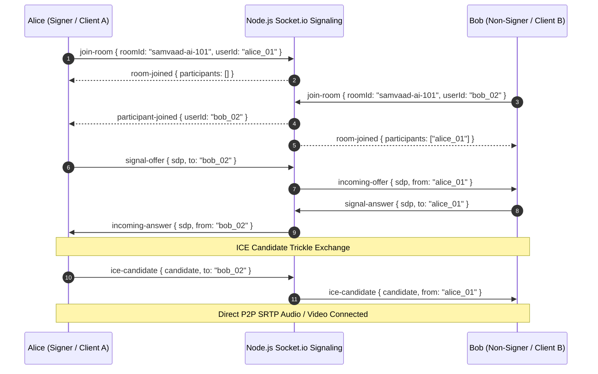
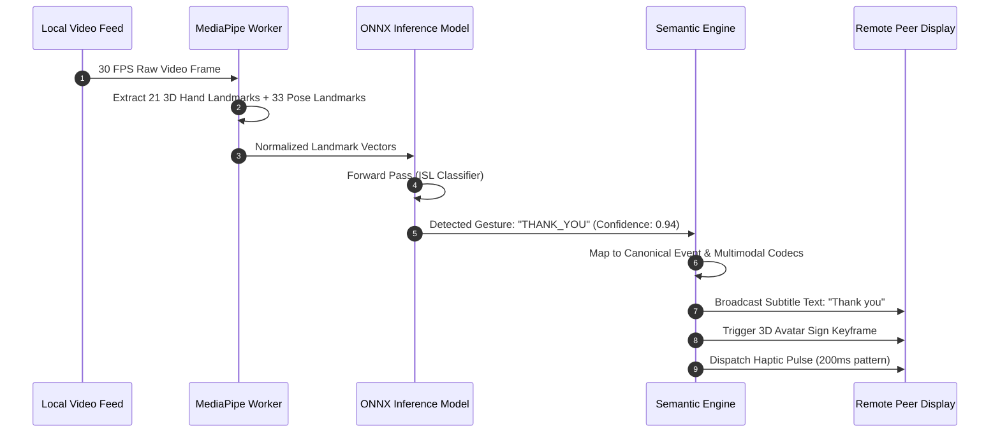

# Samvaad AI: Data Flow & Sequence Blueprints

This document details the exact sequence and runtime event pipelines within the Samvaad AI platform.

---

## 1. WebRTC Signaling & Peer Handshake Sequence

---

## 2. Real-Time Sign Language Translation & Avatar Synthesis Pipeline

