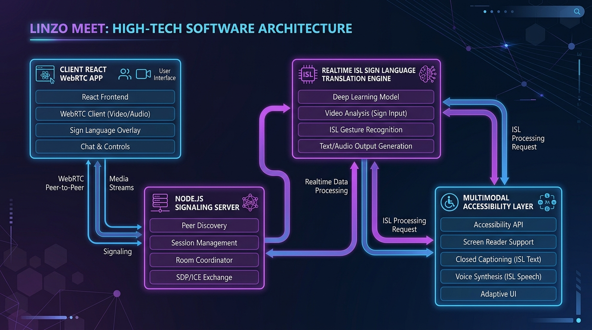

# Samvaad AI: Project Documentation & Architecture Specification

> **AI-Powered Adaptive, Inclusive & Accessible Video Meeting Platform**  
> *Connect Beyond Every Barrier.*

---

## 1. Executive Summary

Samvaad AI is a next-generation video conferencing platform purpose-built for total communication accessibility. Traditional meeting software (Zoom, Google Meet, Microsoft Teams) assumes all participants can hear, speak, and see at standard capability. Samvaad AI breaks down these barriers by providing an adaptive multimodal engine that bridges sign language, speech, text, haptics, and Braille in real time without compromising peer-to-peer video quality or latency.

### Key Capabilities
- **Real-time ISL (Indian Sign Language) Recognition**: Client-side MediaPipe landmark extraction coupled with quantized neural inference models to detect fingerspelling and sign gestures at 30 FPS.
- **Bi-directional 3D Sign Avatar**: Converts incoming speech and captions into 3D avatar animations representing sign language for deaf and hard-of-hearing participants.
- **Multimodal Equivalence Engine**: Automatic translation between speech, text captions, tactile haptic pulses, and Grade 1 ASCII Braille representations.
- **Low-Latency WebRTC Mesh**: Zero-latency peer-to-peer audio/video streaming backed by a lightweight Node.js/Socket.io signaling layer.
- **Private & Edge-First**: Landmark extraction and gesture classification run entirely on-device, preserving user privacy without sending raw video frames to external servers.

---

## 2. System Architecture

Samvaad AI is architected around four decoupled, highly specialized modules:



### Architectural Modules:
1. **Client Application (React + Vite + Tailwind)**:
   - WebRTC media management (audio, video, screen share).
   - MediaPipe Holistic & Hands landmark pipeline running in dedicated Web Workers.
   - 3D humanoid avatar rigging using Three.js and custom bone animations.
   - Dynamic accessibility dashboard with customizable font scaling, high contrast, and symbol-assisted communication grids (AAC).

2. **Signaling & Coordination Server (Node.js + Express + Socket.io)**:
   - WebRTC session coordination (SDP offer/answer exchange, ICE candidate trickle).
   - Real-time room participant presence and state synchronization.
   - JWT authentication and Firebase integration.
   - REST API endpoints for meeting scheduling and audit logs.

3. **Real-time AI & Semantic Engine**:
   - **Gesture Recognition**: Client-side ONNX Runtime Web model for 26 ISL alphabet gestures and core conversational signs.
   - **Semantic Equivalence Mapper**: Normalizes diverse multimodal events (audio, sign, text, Braille) into canonical semantic tokens.
   - **Cloud AI Services**: Twilio voice relay and Google Gemini API for multilingual conversation summaries, sentiment tracking, and context distillation.

4. **Accessibility & Haptic Layer**:
   - Web Vibration API integration for mobile and tactile feedback peripherals.
   - Real-time ASCII Braille encoder/decoder for refreshable Braille display terminals.
   - Native Web Speech API integration for local text-to-speech and speech-to-text fallbacks.

---

## 3. Data Flow & Pipeline

```
[User Camera / Mic]
         │
         ├───▶ [MediaPipe Holistic Landmark Extractor (Client Web Worker)]
         │               │ (21-point hand & body landmarks)
         │               ▼
         │     [Quantized ONNX Gesture Classifier]
         │               │ (Recognized ISL Tokens)
         │               ▼
         │     [Samvaad AI Semantic Engine (Canonical Events)]
         │               │
         │               ├─────────────▶ [Live Subtitles / AAC Symbol Grid]
         │               ├─────────────▶ [Speech Synthesis (TTS)]
         │               └─────────────▶ [Braille Codec / Haptic Pulses]
         │
         └───▶ [WebRTC Peer Connection (Encrypted SRTP Streams)]
                         ▲
                         │ (SDP / ICE Signaling)
                         ▼
             [Node.js / Socket.io Signaling Relay]
```

---

## 4. Repository Structure

Adhering strictly to standard hackathon submission conventions:

```
KH133-Samvaad AI/
├── .gitignore              # Git ignore rules for node_modules, dist, and env files
├── LICENSE                 # Official MIT License
├── README.md               # Primary project showcase with setup & demo guides
├── package.json            # Root multi-package orchestrator scripts
│
├── client/                 # React frontend application
│   ├── public/             # Static assets, models, and MediaPipe runtimes
│   ├── src/
│   │   ├── components/     # Accessible UI components (Room, Navbar, Controls)
│   │   ├── pages/          # LandingPage, Dashboard, Room, Login, Register
│   │   ├── hooks/          # Custom hooks (useMediaControls, useChat)
│   │   ├── App.jsx         # Core router & theme provider
│   │   └── main.jsx        # Application entry point
│   └── vite.config.js      # Optimized Vite build setup
│
├── server/                 # Express backend & signaling service
│   ├── src/
│   │   ├── config/         # Firebase & security configurations
│   │   ├── middleware/     # JWT authentication & request validation
│   │   ├── models/         # MongoDB schemas (User, Meeting, CallLog)
│   │   ├── routes/         # REST API endpoints (auth, meetings, translate)
│   │   ├── socket/         # WebSockets & WebRTC signaling handlers
│   │   └── index.js        # Server bootstrap entry point
│   └── .env.example        # Environment variable template
│
├── docs/                   # Architectural blueprints and engineering guides
│   ├── architecture.png    # High-resolution system architecture blueprint
│   ├── project-documentation.md # This comprehensive technical manual
│   ├── SAMVAAD_SEMANTIC_ENGINE.md # Semantic engine mathematical and technical spec
│   └── other-diagrams/     # Sequence and data-flow specifications
│
├── screenshots/            # Verified visual captures of the running platform
│   ├── screenshot-1.png    # Landing page with adaptive accessibility showcase
│   ├── screenshot-2.png    # Dashboard & meeting coordination console
│   └── README.md           # Screenshot descriptions and walkthrough
│
└── data/                   # Reference datasets, vocabulary manifests & schemas
    ├── README.md           # Dataset documentation & collection methodology
    ├── sample_conversations.json # Multimodal transcript test cases
    ├── isl_gesture_vocab.json    # ISL keyframe and token definitions
    └── accessibility_profiles.json # Persona accessibility configurations
```

---

## 5. Security, Privacy & Compliance

1. **Zero-Knowledge Video Processing**:
   Video streams intended for gesture recognition never leave the client device unencrypted. MediaPipe landmark coordinates are extracted locally, ensuring facial and biometric privacy.
2. **End-to-End Encrypted Media**:
   Peer-to-peer WebRTC connections utilize DTLS (Datagram Transport Layer Security) and SRTP (Secure Real-time Transport Protocol) for all peer communications.
3. **Stateless Signaling**:
   The signaling server acts solely as a handshake mediator. No meeting audio or video recordings are persisted on the signaling tier without explicit host consent.

---

## 6. Installation & Quick Start

### Prerequisites
- Node.js (v18.x or higher)
- npm (v9.x or higher)
- Modern web browser with WebRTC and WebGL support (Chrome, Edge, Firefox, Brave)

### 1. Clone the Repository
```bash
git clone https://github.com/rahulsonkusare-26/KH133-Samvaad AI.git
cd KH133-Samvaad AI
```

### 2. Install All Dependencies
```bash
npm run install:all
```

### 3. Configure Environment Variables
```bash
# Server configuration
cp server/.env.example server/.env
```

### 4. Run Both Client & Server
```bash
npm run dev
```
- **Client Frontend**: `http://localhost:5173`
- **Signaling Server**: `http://localhost:5000`

---

## 7. Contributors

- **Rahul Rushi Sonkusare** ([@rahulsonkusare-26](https://github.com/rahulsonkusare-26)) - *Core Architecture, Signaling & Client Features*
- **Sarang Kadukar** ([@Sarang9975](https://github.com/Sarang9975)) - *AI Inference, Semantic Engine & Accessibility Layer*

Licensed under the [MIT License](../LICENSE).
