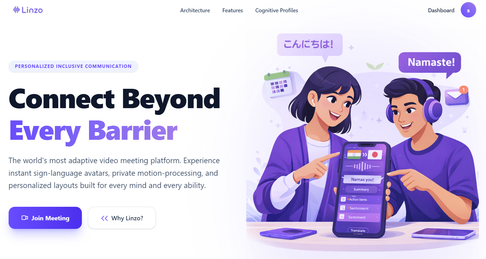
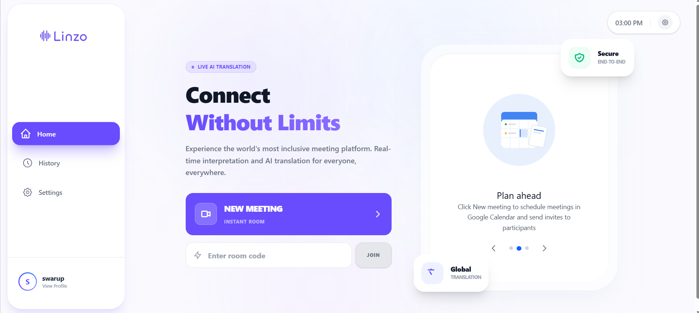

# Platform Screenshots & User Interface Walkthrough

This directory contains real-world captures of the Linzo platform user interface in operation.

---

## 1. Landing Page (`screenshot-1.png`)

- **Headline**: "Connect Beyond Every Barrier"
- **Features Highlighted**:
  - Live AI speech-to-sign avatar preview.
  - Multi-language translation badge (Hindi, Japanese, English, etc.).
  - Real-time sentiment, summary, and action-item tracking indicators.
  - Quick join button with instant room creation.

---

## 2. Meeting Console & Dashboard (`screenshot-2.png`)

- **Headline**: "Connect Without Limits"
- **Console Features**:
  - Instant room generation and room code entry input.
  - Scheduled meetings carousel with Google Calendar sync.
  - End-to-end encryption security badge indicator.
  - Clean, accessible sidebar with High Contrast and AAC toggle controls.
